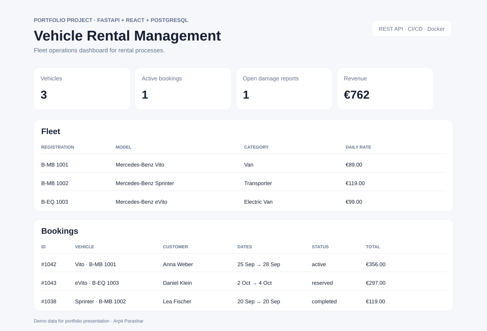

# Vehicle Rental Management System

A portfolio-grade fleet and rental operations application inspired by real-world vehicle-rental workflows.

## Tech stack
- **Backend:** Python, FastAPI, SQLAlchemy, REST APIs
- **Frontend:** React + TypeScript + Vite
- **Database:** PostgreSQL (SQLite fallback for quick local development/tests)
- **DevOps:** Docker Compose, GitHub Actions
- **Version control:** Git/GitHub

## Why this project matters
This project demonstrates the type of end-to-end product work expected from a working student or junior software developer: understanding a business process, modelling it in a database, exposing reliable REST endpoints, connecting a frontend, validating user input, testing critical flows, and automating checks in CI.


## Output preview



The screenshot uses demo data to show the fleet dashboard, active/reserved bookings, rental revenue and vehicle information.

## Architecture
```
React/TypeScript UI  ->  FastAPI REST API  ->  SQLAlchemy  ->  PostgreSQL
                               |
                               +-> validation / business rules / tests
```

## Run with Docker
```bash
docker compose up --build
```
Frontend: `http://localhost:5173`  
API docs: `http://localhost:8000/docs`

## Run locally without Docker
Backend:
```bash
cd backend
python3 -m venv .venv
source .venv/bin/activate
pip install -r requirements.txt
uvicorn app.main:app --reload
```
Frontend:
```bash
cd frontend
npm install
npm run dev
```

## Testing
```bash
cd backend
pytest -q
```

## Domain features
- Fleet/vehicle catalogue with registration number, category and daily rental rate
- Customer records
- Booking lifecycle: reserved -> active -> completed/cancelled
- **Availability conflict check** prevents overlapping bookings for the same vehicle
- Automatic rental-price calculation from rental days × daily rate
- Payment recording
- Damage reports with severity, repair status and estimated cost
- Operations dashboard for fleet size, active bookings, open damages and revenue

## Why it is relevant to Mercedes-Benz Automotive Mobility
The project models processes close to a real rental operation: fleet management, customer bookings, vehicle availability, payment handling and damage assessment. The implementation deliberately separates frontend, backend and persistence and gives you concrete examples to discuss requirements, business rules, REST design and operational tooling.

## Suggested next upgrades
- JWT login with admin/agent/finance roles
- PostgreSQL migrations with Alembic
- Vehicle inspection photo uploads
- Invoice PDF generation
- Datadog/OpenTelemetry observability
- Azure Container Apps or AKS deployment
- GitHub Actions deployment workflow

## Interview talking points
- Explain why the data model is separated into business entities instead of storing everything in one table.
- Walk through one request from React -> FastAPI -> SQLAlchemy -> database -> JSON response.
- Describe one validation/business rule and why it belongs in the backend.
- Explain how GitHub Actions prevents broken code from being merged.
- Mention what you would add for production: authentication/authorization hardening, migrations, observability, secrets management, pagination, rate limiting, and cloud deployment.

## Author
Arpit Parashar  
GitHub: https://github.com/ArpitParashar28  
LinkedIn: https://www.linkedin.com/in/arpit-parashar7777/
